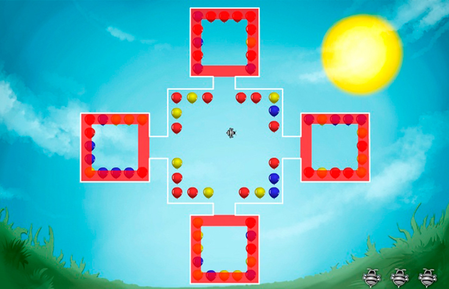

# Bee Balloon

A game made on ActionScript 3.0 with Box2D framework for physics: collisions, animations and mouse interaction.

Play [Bee Balloon](https://www.cognifit.com/en/public/game/2871910706/bee-balloon) online

Read [game concept](concept - BeeBalloon.pdf)

