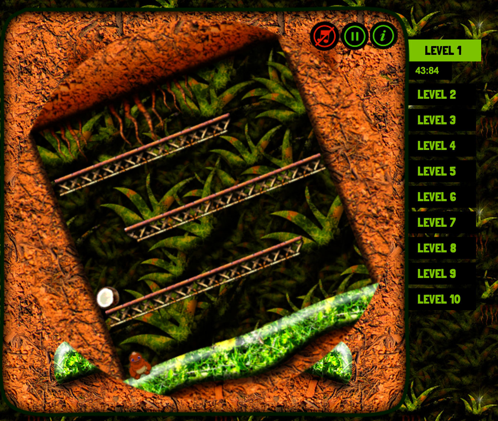

# Coconut Kong

A game made entirely in HTML5 using Canvas API, Web API, Orientation API, and more. Using Box2D for physics. Use [Tiled Map Editor](http://www.mapeditor.org/) for tile maps.

Play [Coconut Kong](https://mindcookin.github.io/assets/coconutkong/index.html) online

See [Coconut Kong's code](https://github.com/MindCookin/CoconutKong) on GitHub

