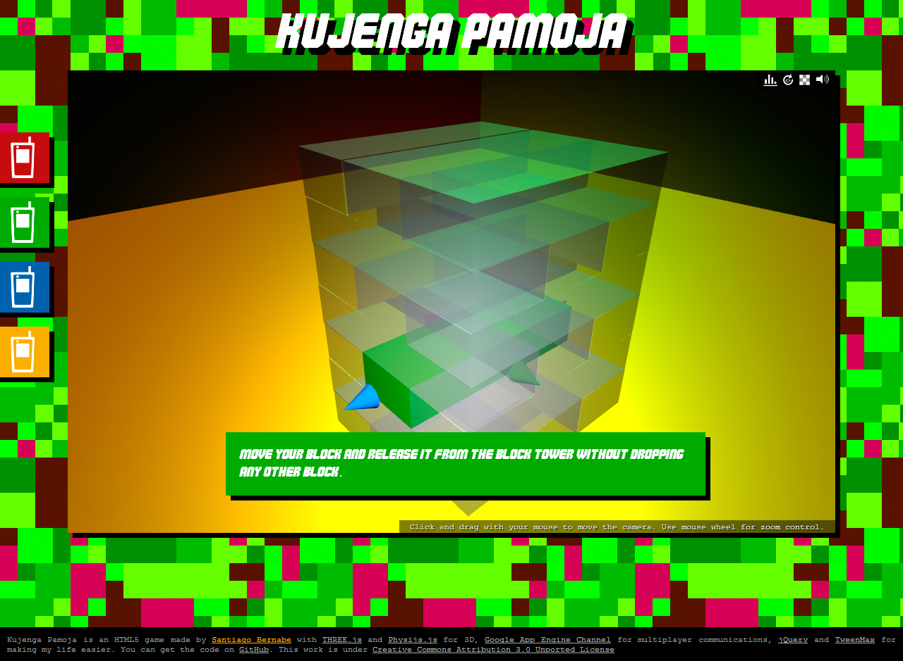
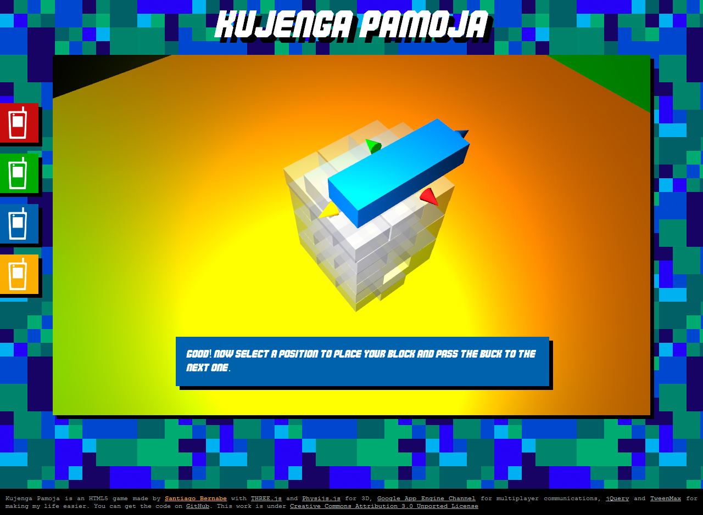
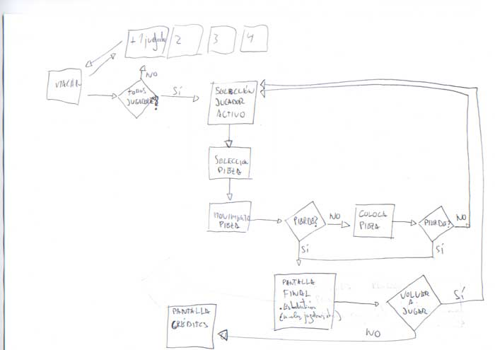
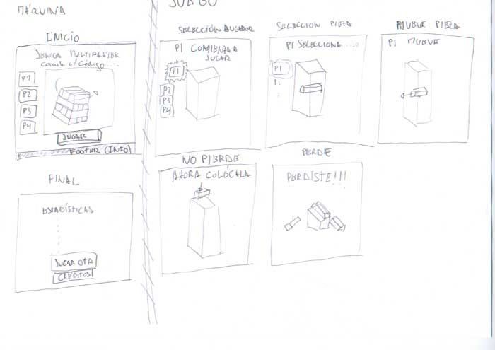

# Kujenga Pamoja

Experimental game exploring WebGL and websockets. Using [ThreeJS](http://threejs.org/) library and [Google App Engine sockets](https://cloud.google.com/appengine/docs/python/sockets/) to create a multiplayer Jenga game connecting smartphone players to a desktop game engine.

**Play [Kujenga Pamoja](http://2.kujenga-pamoja.appspot.com/)**

See Kujenga Pamoja [source code](https://github.com/MindCookin/KujengaPamoja)

Game flow and game mechanics sketches (spanish, sorry :)

