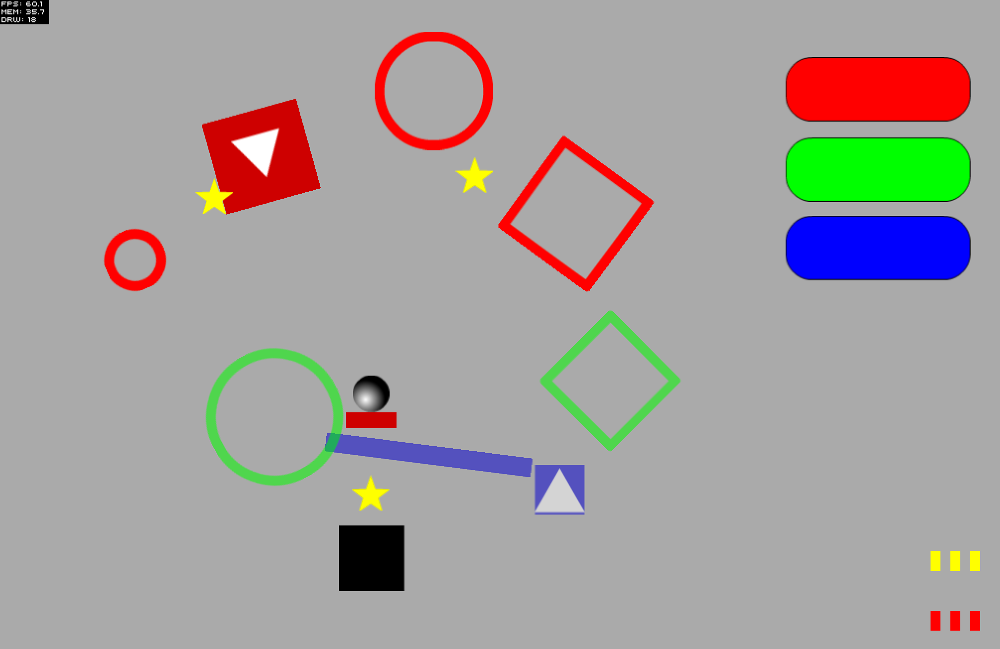

# Move the Ball

ActionScript 3.0 prototype with Box 2D features like collisions, bouncing, gravity changers, listeners... Much fun making it, but finally it did not see the light.

**Play [Move The Ball](index.html) prototype**

Read [Move the ball concept](concept.pdf)

