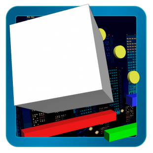
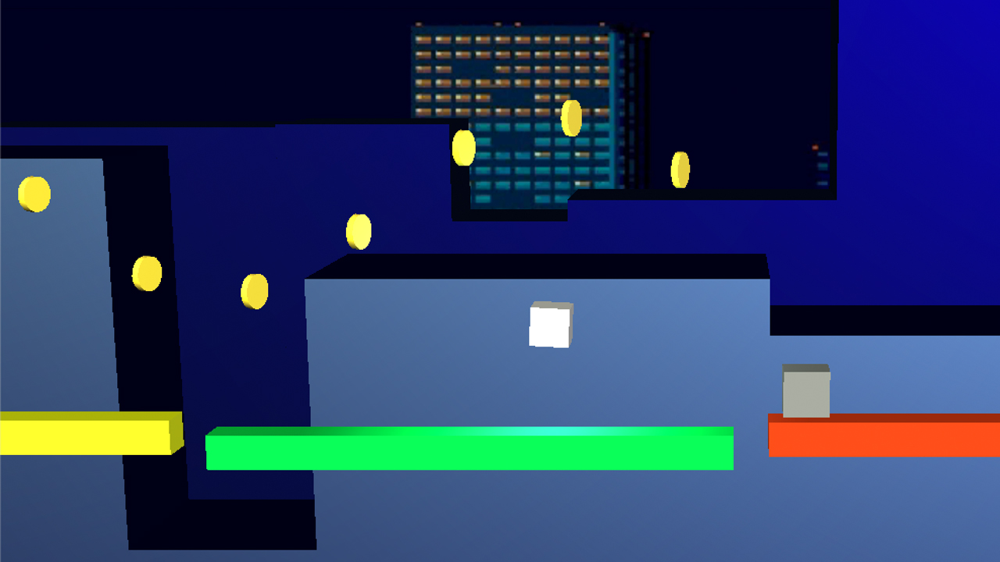

# Run Cube Run

Mobile 3D platformer with multiple game design techniques applied like leaderboards, badges, procedural levels, ads, Google Plus connectivity, enemies behavior, goodies, bombs, physics, engaging music, parallax... Made with Unity3D and C# for the Play Store.

So much fun developing and playing this game ^\_^

**Play [Run Cube Run](https://play.google.com/store/apps/details?id=com.mindcookin.cuberunner)**

See Run Cube Run [source code](https://github.com/MindCookin/Runner)

